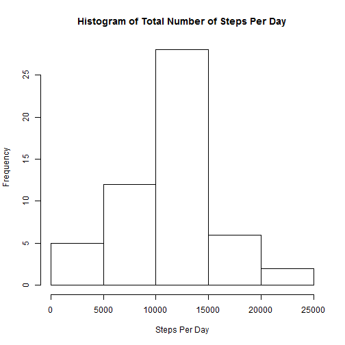
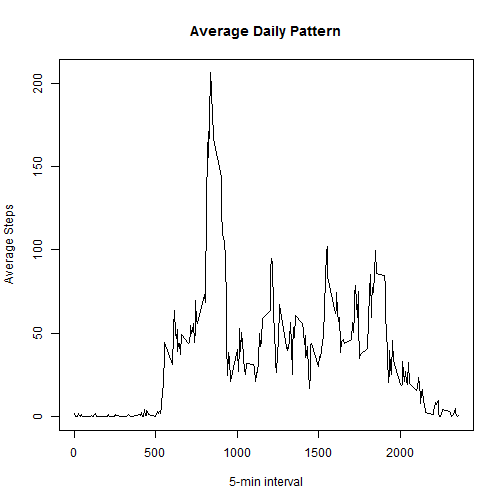
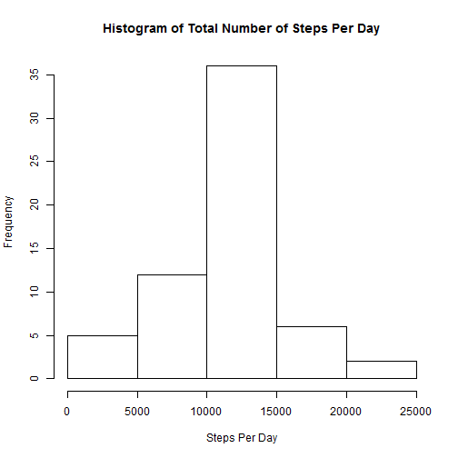
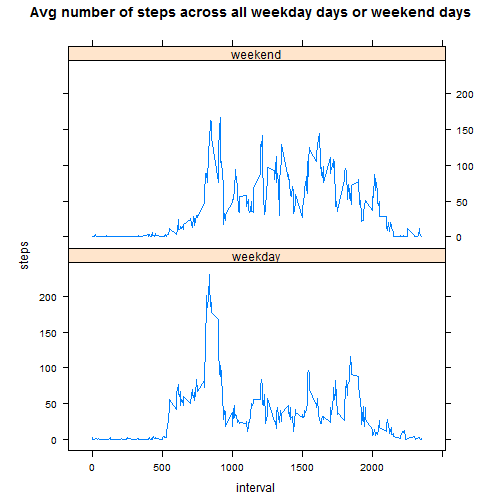

## Loading and preprocessing the data


Load the data.


```r
data<-read.csv("activity.csv",header=TRUE)
```


## What is mean total number of steps taken per day?

Calculate the total number of steps per day.


```r
totalStepsPerDay <- aggregate(steps ~ date, data,sum, na.rm = TRUE)
```

Make a histogram of the total number of steps taken each day


```r
hist(totalStepsPerDay$steps, main="Histogram of Total Number of Steps Per Day", xlab="Steps Per Day")
```



Calculate and report the mean and median of the total number of steps taken per day


```r
mean(totalStepsPerDay$steps)
```

```
## [1] 10766.19
```

```r
median(totalStepsPerDay$steps)
```

```
## [1] 10765
```


## What is the average daily activity pattern?

Make a time series plot (i.e. type = "l") of the 5-minute interval (x-axis) 
and the average number of steps taken, averaged across all days (y-axis)


```r
stepsvsinterval <- aggregate(steps ~ interval, data, mean)
plot(steps ~ interval, data=stepsvsinterval,type="l",main="Average Daily Pattern", xlab="5-min interval",ylab="Average Steps")
```



5-minute interval, on average across all the days in the dataset, contains the maximum number of steps:

```r
stepsvsinterval[which.max(stepsvsinterval$steps),1]
```

```
## [1] 835
```


## Imputing missing values


The total number of missing values in the dataset (i.e. the total number of rows with NAs)


```r
sum(is.na(data))
```

```
## [1] 2304
```
Take a copy of the data.


```r
data2 <- data
```
Replace NA values with mean 5-minute interval 

```r
for(i in 1:nrow(data2)){
	ifelse(is.na(data2[i,]$steps),data2[i,]$steps <- stepsvsinterval[stepsvsinterval$interval == data2[i,]$interval,]$steps,FALSE)
}
```


Make a histogram of the total number of steps taken each day and
calculate and report the mean and median total number of steps taken per day. 
Do these values differ from the estimates from the first part of the assignment? 
What is the impact of imputing missing data on the estimates of the total daily # number of steps?


```r
totalStepsPerDay2 <- aggregate(steps ~ date, data2, sum)
hist(totalStepsPerDay2$steps, main="Histogram of Total Number of Steps Per Day", xlab="Steps Per Day")
```



```r
mean(totalStepsPerDay2$steps)
```

```
## [1] 10766.19
```

```r
median(totalStepsPerDay2$steps)
```

```
## [1] 10766.19
```


## Are there differences in activity patterns between weekdays and weekends?

We will use the dataset with the filled-in missing values for this part.
Create a new factor variable in the dataset with two levels – “weekday” and “weekend” 
indicating whether a given date is a weekday or weekend day.


```r
data2$date <- as.Date(data2$date)
library(chron)
data2$daytype <- factor(chron::is.weekend(data2$date),levels=c(FALSE,TRUE),labels=c('weekday','weekend'))
```

Make a panel plot containing a time series plot (i.e. type = "l") of the 5-minute interval (x-axis)
and the average number of steps taken, averaged across all weekday days or weekend days (y-axis). 


```r
stepsvsdaytype <- aggregate(steps ~ interval + daytype, data2, mean)
xyplot(steps ~ interval | factor(daytype), data = stepsvsdaytype, type="l", aspect=1/2, main="Avg number of steps across all weekday days or weekend days")
```


